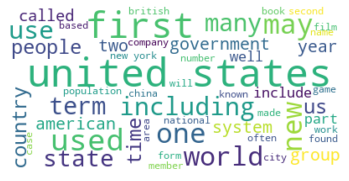

# Wikipedia-Protection-with-nlp

## Overview

Wikipedia, as the name implies, is the Encyclopedia of the 21st century! It is an amazing place full of free information maintained by a community of volunteer editors. It has assisted in the removal of barriers when it comes to giving and receiving knowledge. Unfortunately, with this great democratization comes the potential spread of misinformation and plagiarized content. With the rise of complex transformer models such as GPT2, AI can generate persuasive content that is practically identical to human written text.
See what I mean!: https://techcrunch.com/2019/02/17/openai-text-generator-dangerous/
This is where machine learning can help! We can train a Machine learning model to classify whether or not a body of text has been written by a human or an AI and use other NLP strategies to catch plagiarism. If this seems like a problem you care about then keep reading!
If this project interests you feel free to shoot me an email via aacjpw@gmail.com

## Obtaining and Cleaning Data

# Text Generator
I used the BeautifulSoup library to scrape 1,000 Wikepedia articles and cleaned out all of the breaklines and unknown character tags. I then trained GPT2 on the articles.

# Text Classifier
I used GPT2 to generate 180 Wikipedia articles and put them into a dataframe. Next, I put the scraped articles in a seperate dataframe, and selected a random sample of 180 articles and merging them with the generated articles to create a dataset of 360 articles. The dataset is so small because the sequences are very long and we would run into rescource issues.

## Generative Model
As mentioned earlier, I generated the fake articles with GPT2, a massive pre-trained neural network with a state of the art transformer architecture, to be more specific I used the 355M parameter version as the smaller 117M is best for datasets under 10MB. This process was fairly simple as the model was already built for me, however I did have to downgrade to tensorflow 1.15 because GPT2 is dependent on the tf.contrib module which does not exist in tensorflow 2. I also had to upgrade to colabs pro in order to have enough ram to train the model and generate all the text.

## Classification Model
1. I ran a gridsearch on GRUs and LSTM's
2. I ran a gridsearch on Bidirectional LSTMs and GRUs
3. Utimatley, a Bidirectional LSTM with 64 nodes and a tanh activation function did the best

## Bringing it to life with Flask and Heroku

I used Flask and Heroku to make a public demo out of this model, In order to build the app I had to go through a 6 step process.

1. save model and download it
2. create an html template for the app
3. write app script with Flask
4. write in dependancies to requitements.txt, Flask, Jinjin2, gunicorn, and Tensorflow
5. write a procfile to declare which commands to run
6. connect repository to Heroku

view here to demo: https://ai-written-text-api.herokuapp.com/

## EDA
With this being a Deep NLP problem there wasn't much need for eda, However I made a word cloud that represents frequently used words to compare the AI generated articles to the real ones.
AI generated(above)...

Real Articles(above)...

I will also make note that the AI generated articles are 0.44% stopwords while the real ones are 0.39%.

## Future Works
A great follow up to this project would be to train the classifier on more data, most likley through the cloud
